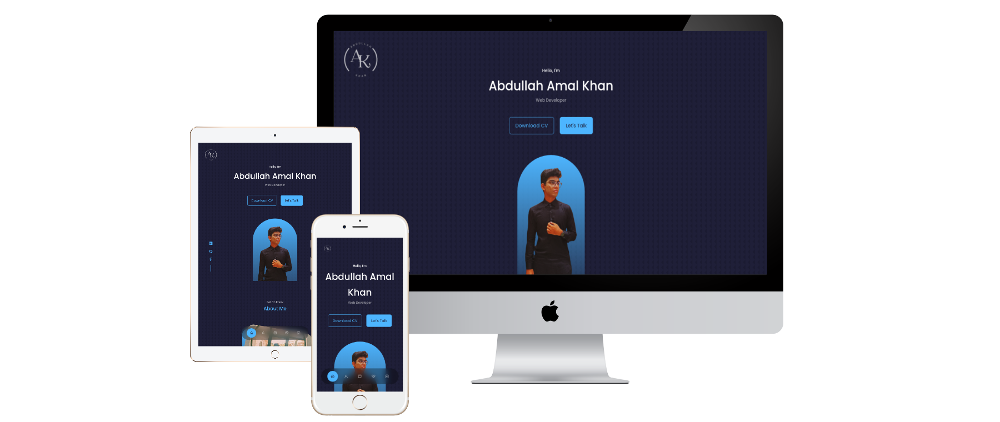

<h2>
  🌐<a href="https://probablyabdullah.github.io/portfolio/">https://probablyabdullah.github.io/portfolio</a>🌐
</h2>

  

  
  
  
  

## Salient Features ✅

⚡️Fully responsive with slides and clickable elements 
⚡️Repeated texture background 
⚡️Seperately developed for media queries from screens of all sizes 
⚡️Smooth scrolling throughout the page 
⚡️All links open in a separate page 
⚡️Look for little react easter eggs every here and there! 

## Tools & Techniques 🛠️

🧩[**GitHub Pages**](https://docs.github.com/en/pages) - Hosts the website and all it's required assets. 
🧩[**Google Fonts**](https://fontawesome.com/) - The main font Poppins and it's versions. 
🧩[**Swiper.js**](https://swiperjs.com/) - The most efficient slider templates for react. 
🧩[**Coolors**](https://coolors.co/) - Color palette generator for uniformity. 
🧩[**React-icons**](https://react-icons.github.io/react-icons)) - Easily importable uniform icons. 
🧩[**Email.js**](https://www.emailjs.com/)) - Form input straight to personal email forwarding. 

## Components 📂

🔩 Header \
🔩 About \
🔩 Education \
🔩 Experience \
🔩 Achievements \
🔩 Portfolio \
🔩 Projects \
🔩 Contact \
🔩 Footer \
🔩 Sticky Navbar \

## Contributing Guidelines 📃

Thank you for your interest in contributing! Follow these guidelines:

1. Fork and clone the repository.
2. Install dependencies.
3. Create a new branch for your contribution.

Make clear, concise commits with proper documentation. Test thoroughly before submitting a pull request. Follow coding style and conventions. Report issues and suggest improvements.

We appreciate your contribution!🌈

⭐️ Please show some ❤️ and support by giving this project a star on GitHub! Let's make it even better together! ✨

